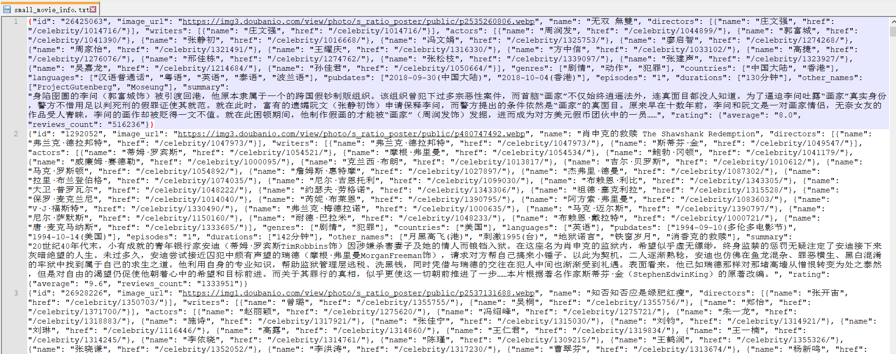
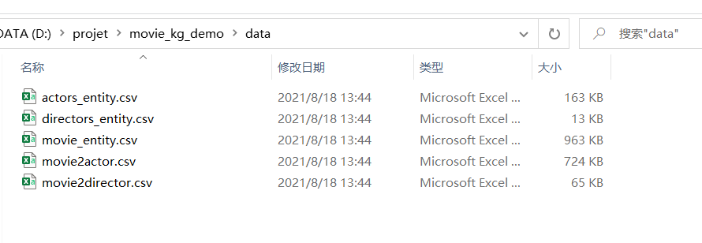
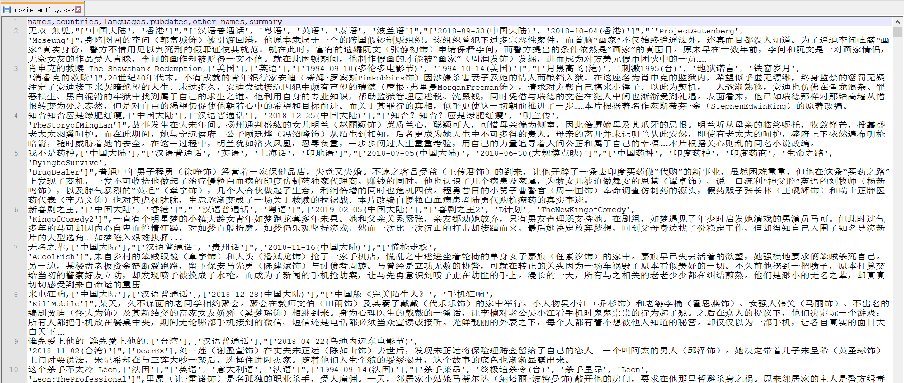
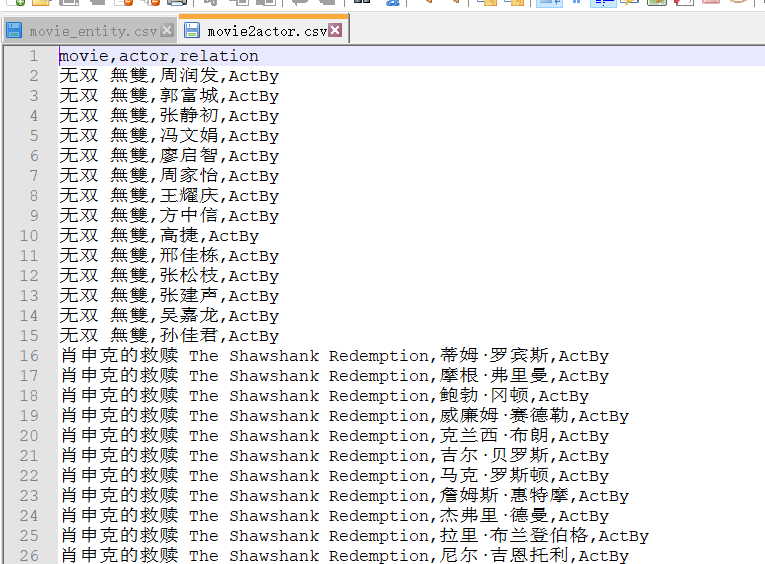
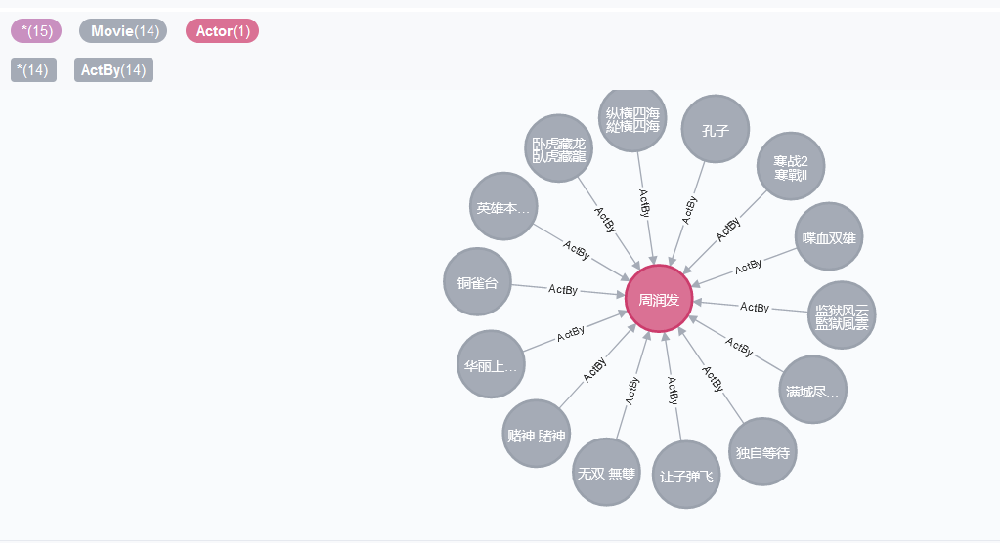

# movie_kg_demo
搭建一个小的电影知识图谱

我爬取了一个电影网站，得到了一千条电影的信息：

这个项目将描述如何使用这些电影数据搭建一个电影知识图谱，知识图谱中包含演员，电影，导演三种实体和参演，导演两种关系。

1. 从电影信息中解析出实体和关系
 直接运行`get_data.py`，会生成三种实体文件和两种关系文件，我放在了data文件夹下：
 

movie_entity.csv文件格式：

movie2actor.csv文件格式：


2. 导入neo4j数据库：
 开启neo4j数据库，一词导入实体信息和关系信息：
 
 导入实体信息：
 

``` 
load csv from "file:///actors_entity.csv" as line create (a:Actor{name:line[0]})
```

``` 
load csv from "file:///directors_entity.csv" as line create (d:Director{name:line[0]})
```

``` 
load csv from "file:///movie_entity.csv" as line create (m:Movie{name:line[0],country:line[1],language:line[2],pubdate:line[3],other_name:line[4],summary:line[5]})
```

导入关系信息：

``` 
load csv from "file:///movie2actor.csv" as line match (m:Movie{name:line[0]}),(a:Actor{name:line[1]}) merge (m)-[r:ActBy]->(a)
```

``` 
load csv from "file:///movie2director.csv" as line match (m:Movie{name:line[0]}),(d:Director{name:line[1]}) merge (m)-[r:DirectBy]->(d)
```

导入完成之后，就完成了知识图谱的构建，比方说，我们想看看周润发演过哪些电影：

``` 
match x=(:Movie)-[]->(a:Actor{name:'周润发'}) return x
```
结果我们找到：
